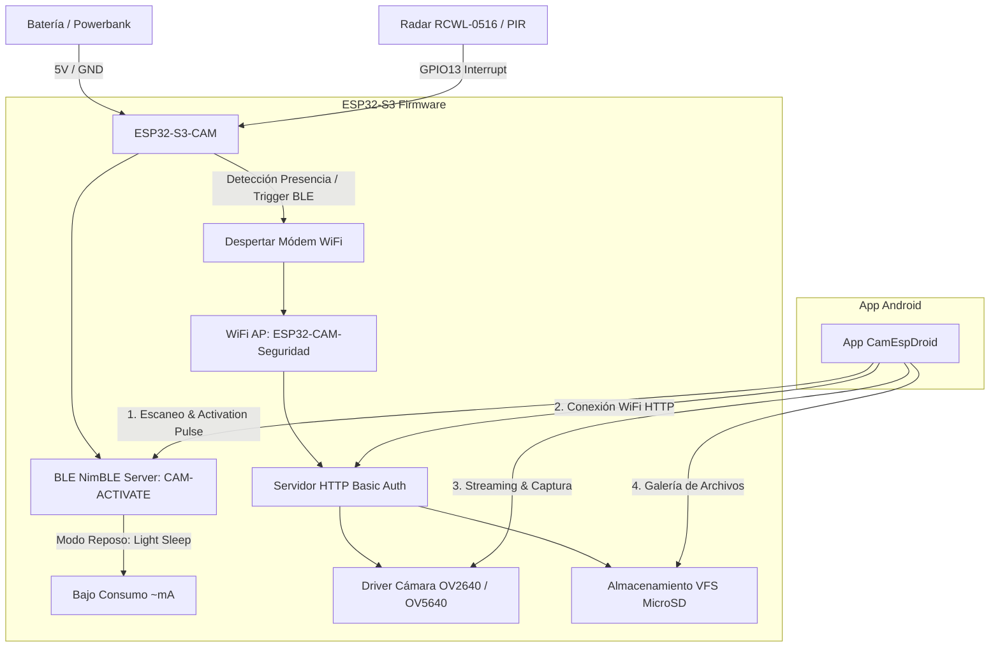

# 🛡️ ESP32-S3-CAM Security & Remote Vision System

Un sistema de seguridad IoT de ultra-bajo consumo y visión remota compuesto por un **Firmware nativo en Rust para ESP32-S3-CAM** y una **Aplicación Móvil Android nativa en Kotlin con Jetpack Compose**.

El sistema permite operar un módulo de cámara de seguridad oculto totalmente a distancia (sin pulsar ningún botón físico), manteniéndolo en estado de reposo de micro-amperios hasta que se activa por detección de presencia (sensor radar/PIR) o por una señal remota **Bluetooth Low Energy (BLE)** emitida desde la app móvil, levantando en ese instante su propio punto de acceso **WiFi** para transmisión de vídeo y gestión de tarjeta MicroSD.

---

## 📐 Arquitectura General del Sistema



---

# 🔴 SECCIÓN I: HARDWARE Y FIRMWARE ESP32-S3-CAM (RUST)

## 1.1 Especificaciones de Hardware y Pinout

El firmware está optimizado para la placa **ESP32-S3-CAM** (procesador Xtensa LX7 Dual-Core a 240 MHz con 16MB de Flash y Soporte PSRAM).

### Esquema de Conexiones de Pines

| Componente | Pin ESP32-S3 | Función / Descripción |
| :--- | :--- | :--- |
| **Alimentación** | `5V` | Entrada de alimentación (Powerbank / Regulador) |
| **Tierra** | `GND` | Referencia común de masa |
| **Radar RCWL-0516** | `GPIO13` | Entrada de interrupción digital (`ext0_wakeup`) |
| **Cámara XCLK** | `GPIO15` | Reloj del sensor de cámara |
| **Cámara SIOD (SDA)**| `GPIO4` | Bus I2C de configuración del sensor (SCCB) |
| **Cámara SIOC (SCL)**| `GPIO5` | Reloj I2C del sensor (SCCB) |
| **Cámara VSYNC** | `GPIO6` | Sincronización vertical de cuadro |
| **Cámara HREF** | `GPIO7` | Sincronización horizontal de línea |
| **Cámara PCLK** | `GPIO13` | Reloj de píxeles del sensor |
| **Cámara D0 - D7** | `GPIO11, 9, 8, 10, 12, 18, 17, 16` | Bus paralelo de datos de imagen |
| **Cámara PWDN** | `GPIO-1` (Deshabilitado)| Control de apagado del sensor |
| **Cámara RESET** | `GPIO-1` (Deshabilitado)| Reset por software del sensor |

---

## 1.2 Gestión de Ultra-Bajo Consumo (BLE Light Sleep)

Para garantizar máxima autonomía funcionando con baterías:
1. **Light Sleep Asíncrono**: El firmware configura el reloj de FreeRTOS en modo *Tickless Idle* y habilita la fuente de activación por cambio de estado en `GPIO13`.
2. **Servidor BLE Persistente**: El protocolo Bluetooth LE (**NimBLE**) permanece emitiendo paquetes de anuncio (*Advertising*) bajo el identificador **`CAM-ACTIVATE`**.
3. **Cero Botones Físicos**: Al recibir una conexión BLE desde la aplicación móvil, la interrupción del módem despierta al procesador principal, apaga el modo de ahorro de energía y enciende la interfaz **WiFi Access Point**.

---

## 1.3 Arquitectura del Código del Firmware (`esp32_cam_sec/`)

El código está escrito en **Rust puro** (`xtensa-esp32s3-espidf`) utilizando la capa HAL y SVC de ESP-IDF v5.2, e integrando el driver C oficial de Espressif (`esp32-camera`).

### Módulos Principales:

* [build.rs](file:///home/victor/develop/iot/camesp32/esp32_cam_sec/build.rs): Script de compilación personalizada. Compila los archivos fuente en C del driver de la cámara (`esp_camera.c`, `cam_hal.c`, `sccb.c`, `ov2640.c`, `ov5640.c`, `ll_cam.c`) usando el compilador `xtensa-esp32s3-elf-gcc`. Aplica la bandera `-mlongcalls` para evitar errores de reubicación en la memoria IRAM de interrupciones.
* [src/main.rs](file:///home/victor/develop/iot/camesp32/esp32_cam_sec/src/main.rs): Orquestador principal del sistema. Inicializa el almacenamiento, la cámara y el servidor BLE, ejecutando el bucle de control de energía y despertares.
* [src/camera.rs](file:///home/victor/develop/iot/camesp32/esp32_cam_sec/src/camera.rs): Envoltorio de bindings FFI C -> Rust para inicializar la matriz de la cámara y capturar buffers de imagen en formato JPEG nativo.
* [src/ble.rs](file:///home/victor/develop/iot/camesp32/esp32_cam_sec/src/ble.rs): Implementación de la pila Bluetooth NimBLE con servicio personalizado de recepción de eventos de activación.
* [src/wifi.rs](file:///home/victor/develop/iot/camesp32/esp32_cam_sec/src/wifi.rs): Configuración del punto de acceso SoftAP con SSID `ESP32-CAM-Seguridad` y clave WPA2 `12345678`.
* [src/server.rs](file:///home/victor/develop/iot/camesp32/esp32_cam_sec/src/server.rs): Servidor HTTP empotrado con soporte de autenticación HTTP Basic Auth (`admin`/`admin123`), streaming de fotogramas (`/capture`) y listado de archivos SD (`/sdcard/`).
* [src/storage.rs](file:///home/victor/develop/iot/camesp32/esp32_cam_sec/src/storage.rs): Controlador del sistema de archivos VFS FATFS para lectura/escritura en tarjeta MicroSD.
* [sdkconfig.defaults](file:///home/victor/develop/iot/camesp32/esp32_cam_sec/sdkconfig.defaults): Configuración de ESP-IDF para 16MB de memoria Flash y asignación de la tabla de particiones ampliada `CONFIG_PARTITION_TABLE_SINGLE_APP_LARGE` (3.9 MB de aplicación).

---

## 1.4 Compilación y Flasheo del ESP32-S3

### Requisitos Previos
- Toolchain de Rust para Xtensa (`espup`).
- Herramienta de flasheo `cargo-espflash`.

### Comandos de Instalación y Carga:

```bash
# 1. Navegar al directorio del firmware
cd esp32_cam_sec

# 2. Cargar variables de entorno del toolchain Xtensa
source ~/.cargo/env
source ~/export-esp.sh

# 3. Compilar y flashear en modo Release (Optimizado)
cargo espflash flash --release --port /dev/ttyACM0 --monitor
```

---

# 🔵 SECCIÓN II: APLICACIÓN MÓVIL ANDROID (KOTLIN + JETPACK COMPOSE)

## 2.1 Arquitectura del Software (`camesp32android/`)

La aplicación móvil está desarrollada siguiendo **Android Clean Architecture**, **MVVM (Model-View-ViewModel)** y **Unidirectional Data Flow (UDF)** usando **Jetpack Compose UI**.

```text
com.vicherarr.camespdroid
 ├── ble/
 │    └── BleManager.kt        # Escaneo y envío de señal de activación BLE
 ├── model/
 │    └── MediaItem.kt         # Modelo de datos para imágenes/vídeos de la SD
 ├── network/
 │    └── CameraRepository.kt  # Cliente HTTP OkHttp con Basic Auth
 ├── viewmodel/
 │    └── MainViewModel.kt     # ViewModel centralizado y gestión de StateFlow
 └── ui/
      ├── screens/
      │    ├── HomeScreen.kt        # Dashboard & Botón animado de pulso BLE
      │    ├── LiveStreamScreen.kt  # Reproductor HTTP Stream & Disparador
      │    ├── GalleryScreen.kt     # Galería de imágenes SD y Modal de detalles
      │    └── SettingsScreen.kt    # Configuración de IP y credenciales
      ├── theme/
      │    ├── Color.kt             # Sistema de diseño con paleta HSL oscura
      │    └── Theme.kt             # Configuración de MaterialTheme Material3
      └── MainScreen.kt             # Scaffold, BottomBar y Control de Permisos
```

---

## 2.2 Componentes Técnicos Detallados

### 1. Despertar Remoto BLE (`BleManager.kt`)
- Realiza escaneos en segundo plano filtrando por el nombre de dispositivo `CAM-ACTIVATE`.
- Al encontrar el dispositivo, establece conexión GATT, descubre sus servicios y escribe una característica de activación para provocar el despertar instantáneo del ESP32-S3 sin requerir pulsaciones de botones.
- Admite compatibilidad dinámica de permisos según la versión de Android (Android 12+ `BLUETOOTH_SCAN`/`BLUETOOTH_CONNECT` vs Android 11- `LOCATION`).

### 2. Capa de Red y Autenticación (`CameraRepository.kt`)
- Utiliza la librería **OkHttp 4** para realizar peticiones autenticadas mediante el encabezado `Authorization: Basic <base64>`.
- Procesa el listado de archivos alojados en la tarjeta MicroSD parsing expresiones regulares sobre la respuesta indexada del servidor web del ESP32.

### 3. Carga y Streaming Multimedia (`LiveStreamScreen.kt` & `GalleryScreen.kt`)
- Utiliza **Coil Compose** para el renderizado asíncrono y en memoria de imágenes HTTP.
- Implementa un bucle de refresco continuo para simular un feed de vídeo MJPEG en tiempo real a alta velocidad.
- Permite la visualización en modal emergente con detalles del archivo e inspección en alta resolución.

---

## 2.3 Permisos Requeridos (`AndroidManifest.xml`)

La aplicación solicita los siguientes permisos de sistema:
```xml
<uses-permission android:name="android.permission.INTERNET" />
<uses-permission android:name="android.permission.ACCESS_NETWORK_STATE" />
<uses-permission android:name="android.permission.ACCESS_WIFI_STATE" />
<uses-permission android:name="android.permission.CHANGE_WIFI_STATE" />
<uses-permission android:name="android.permission.BLUETOOTH_SCAN" />
<uses-permission android:name="android.permission.BLUETOOTH_CONNECT" />
<uses-permission android:name="android.permission.ACCESS_FINE_LOCATION" />
```

---

## 2.4 Compilación del APK de Android

### Requisitos:
- JDK 17
- Gradle 8.8+ / AGP 8.8.0

### Comando de Compilación:
```bash
# Entrar al directorio Android
cd camesp32android

# Compilar el binario APK de depuración
./gradlew assembleDebug
```
El archivo APK resultante se generará en: `app/build/outputs/apk/debug/app-debug.apk`.

---

# 🟢 SECCIÓN III: GUÍA DE OPERACIÓN PASO A PASO

1. **Alimentar el Dispositivo**: Conecta el módulo ESP32-S3-CAM a tu batería o fuente de 5V. El LED indicará el estado de reposo y comenzará a emitir la señal BLE `CAM-ACTIVATE`.
2. **Abrir la App Android**: Inicia **CamEspDroid** en tu smartphone Android y concede los permisos de Bluetooth solicitados.
3. **Despertar a Distancia**: En la pantalla de **Inicio**, pulsa el botón central animado de pulso BLE. La app se conectará al ESP32-S3 en menos de 2 segundos y encenderá la red WiFi de la cámara.
4. **Conectar al WiFi**: Conéctate desde tu teléfono a la red WiFi `ESP32-CAM-Seguridad` (Clave: `12345678`).
5. **Visión en Vivo y Gestión**:
   - Pulsa en la pestaña **En Vivo** para ver la transmisión de la cámara en tiempo real.
   - Pulsa en **Capturar Foto SD** para tomar fotos instantáneas.
   - Entra en la pestaña **Galería SD** para explorar, abrir y descargar todas las fotografías guardadas en el dispositivo.

---

## 📄 Licencia

Este proyecto está bajo la licencia MIT. Desarrollado para uso en proyectos IoT de seguridad y videovigilancia de bajo consumo.
