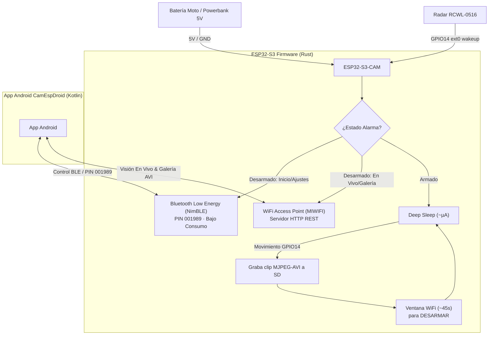

# 🛡️ ESP32-S3-CAM Moto Remote Vision & Security System

Un sistema de videovigilancia e IoT de bajo consumo compuesto por un **Firmware nativo en Rust para ESP32-S3-CAM** y una **Aplicación Móvil Android nativa en Kotlin con Jetpack Compose**.

---

## 📚 Documentación y Manuales Oficiales

Para consultar la información detallada del proyecto, accede a los manuales específicos ubicados en la carpeta [`docs/`](file:///home/victor/develop/iot/camesp32/docs):

- 📖 [**Manual del Dispositivo (Hardware, Leds, PIN 001989 y Operación)**](file:///home/victor/develop/iot/camesp32/docs/MANUAL_DISPOSITIVO.md)
- 📱 [**Manual de la Aplicación Android (Instalación, Pestañas y Transiciones)**](file:///home/victor/develop/iot/camesp32/docs/MANUAL_APP_ANDROID.md)
- 🏗️ [**Manual Técnico de Desarrollo (Desglose Completo de Código Rust y Kotlin)**](file:///home/victor/develop/iot/camesp32/docs/MANUAL_DESARROLLO_TECNICO.md)

---

## 📐 Arquitectura General del Sistema

El sistema utiliza un esquema **Híbrido de Bajo Consumo (BLE + WiFi Bajo Demanda)**:

---

## ⚡ Aspectos Clave del Sistema

1. **Bluetooth Low Energy (BLE) Always-On (Bajo Consumo):**
   - El canal principal de control en standby utiliza el stack NimBLE con emparejamiento por **PIN seguro `001989`** guardado en NVS (Bonding).
   - Permite armar/desarmar la alarma, conocer el estado del sensor y sincronizar la hora sin consumir batería.

2. **WiFi Bajo Demanda (Transición Implícita):**
   - El WiFi **solo se enciende cuando entras a la pestaña En Vivo o Galería** de la app.
   - La app muestra una **pantalla de progreso con cuenta atrás de 8 segundos** mientras realiza la vinculación local.
   - Al volver a la pestaña Inicio o Ajustes, el WiFi se apaga automáticamente y la radio vuelve a modo BLE.

3. **Optimizaciones de Memoria RAM:**
   - El firmware ejecuta `ble::shutdown()` liberando ~50 KB de RAM antes de levantar el WiFi para garantizar el funcionamiento fluido de la cámara y el servidor HTTP.

4. **Grabación de Vídeo MJPEG-AVI en SD:**
   - En modo armado, el radar despierta al procesador en milisegundos y graba clips `.AVI` completos con cabeceras RIFF y parcheado dinámico de FPS reales medidos.

5. **Reproductor AVI Integrado en la App Android:**
   - La app Android incluye un reproductor binario nativo escrito en Kotlin (`MjpegAviPlayer.kt`) que decodifica y reproduce los fotogramas del vídeo directamente sin depender de reproductores externos como VLC.

---

## 🚦 Leyenda de Colores del LED RGB (GPIO48)

| Estado | Color | Patrón | Significado |
| :--- | :--- | :--- | :--- |
| **Arrancando** | 🔴 rojo | fijo | Inicializando periféricos y hardware |
| **Standby Desarmado**| 🟢 verde | pulso | Esperando en bajo consumo |
| **Conectado BLE** | 🩵 cian | intercalado (1s) | App vinculada por Bluetooth |
| **Conectado WiFi** | 💛 amarillo | intercalado (1s) | Transmitiendo vídeo / galería por WiFi |
| **Ventana Armada** | 🔵 azul | parpadeo | Ventana abierta tras despertar para desarmar |
| **Grabando Vídeo** | 🟣 magenta | fijo | Grabando clip MJPEG-AVI por presencia |
| **Deep Sleep** | ⚫ apagado | — | Bajo consumo activo (~µA) |
| **Error Crítico** | 🔴 rojo | parpadeo rápido | Fallo de tarjeta MicroSD o cámara |

---

## ⚙️ Estructura del Repositorio

- [`esp32_cam_sec/`](file:///home/victor/develop/iot/camesp32/esp32_cam_sec): Proyecto completo de Firmware en Rust (ESP-IDF v5.2, NimBLE, RMT, VFS SDMMC).
- [`camesp32android/`](file:///home/victor/develop/iot/camesp32/camesp32android): Proyecto de la Aplicación Móvil Android en Kotlin (Jetpack Compose, MVVM, OkHttp, ConnectivityManager).
- [`carcasa_3d/`](file:///home/victor/develop/iot/camesp32/carcasa_3d): Modelos 3D y archivos CAD (.STEP, .STL, .FCStd) para la carcasa protectora.
- [`docs/`](file:///home/victor/develop/iot/camesp32/docs): Manuales completos del dispositivo, de la app y del desarrollo técnico.

---

## 📄 Licencia

Este proyecto está distribuido bajo la licencia MIT. Desarrollado para videovigilancia IoT de alto rendimiento y bajo consumo.
