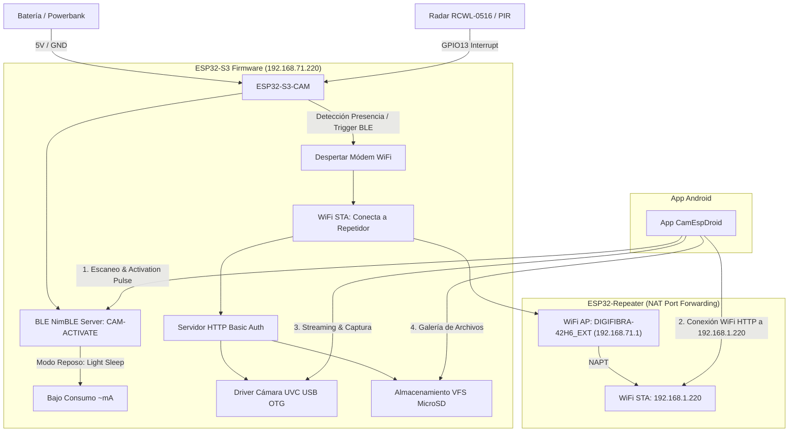

# 🛡️ ESP32-S3-CAM Security & Remote Vision System

Un sistema de seguridad IoT de ultra-bajo consumo y visión remota compuesto por un **Firmware nativo en Rust para ESP32-S3-CAM** y una **Aplicación Móvil Android nativa en Kotlin con Jetpack Compose**.

El sistema permite operar un módulo de cámara de seguridad oculto totalmente a distancia (sin pulsar ningún botón físico), manteniéndolo en estado de reposo de micro-amperios hasta que se activa por detección de presencia (sensor radar/PIR) o por una señal remota **Bluetooth Low Energy (BLE)** emitida desde la app móvil, levantando en ese instante su propio punto de acceso **WiFi** para transmisión de vídeo y gestión de tarjeta MicroSD.

---

## 📐 Arquitectura General del Sistema




---

# 🔴 SECCIÓN I: HARDWARE Y FIRMWARE ESP32-S3-CAM (RUST)

## 1.1 Especificaciones de Hardware y Pinout

El firmware está optimizado para la placa **Freenove ESP32-S3-WROOM CAM** (procesador Xtensa LX7 Dual-Core a 240 MHz, 8 MB de Flash + 8 MB de PSRAM octal). La cámara es la **integrada de serie (sensor GC0308) por cable plano / bus DVP**, no una cámara USB.

### Esquema de Conexiones de Pines

| Componente | Pin ESP32-S3 | Función / Descripción |
| :--- | :--- | :--- |
| **Alimentación** | `5V` (vía USB-C) | Se alimenta por cualquiera de los dos USB-C de la placa |
| **Tierra** | `GND` | Referencia común de masa |
| **Radar RCWL-0516 (OUT)** | `GPIO14` | Entrada digital de movimiento (`ext0_wakeup`). ⚠️ **Antes GPIO13**, que colisionaba con el PCLK de la cámara |
| **Cámara GC0308 (DVP, de serie)** | XCLK=15, SDA=4, SCL=5, D0..D7=11/9/8/10/12/18/17/16, VSYNC=6, HREF=7, PCLK=13 | Cámara integrada por cable plano (bus paralelo DVP) |
| **LED de estado RGB (WS2812)** | `GPIO48` | LED de a bordo que indica el estado (arranque / WiFi / cámara) |
| **MicroSD (SDMMC 1-bit)** | CLK=39, CMD=38, D0=40 | Almacenamiento de fotos |
| **USB-OTG nativo** | `GPIO19/20` (D-/D+) | Reservado para USB host (no usar para otros fines) |

### 🔌 Diagrama de Cableado: Sensor de Presencia <---> ESP32-S3-CAM

```text
       ┌────────────────────────┐                   ┌────────────────────────┐
       │   Sensor Radar         │                   │     ESP32-S3-CAM       │
       │    RCWL-0516           │                   │                        │
       │  ┌──────────────────┐  │                   │  ┌──────────────────┐  │
       │  │       3V3        ├──┼─── (NC)           │  │       5V         ├──┼─── (VCC 5V)
       │  │       GND        ├──┼───────────────────┼──┤       GND        │  │
       │  │       OUT        ├──┼───────────────────┼──┤      GPIO14      │  │
       │  │       VIN        ├──┼───────────────────┼──┤       5V         │  │
       │  │       CDS        ├──┼─── (NC)           │  └──────────────────┘  │
       │  └──────────────────┘  │                   └────────────────────────┘
       └────────────────────────┘
```

#### Detalle de Conexión Pin a Pin:
1. **VIN (Sensor)** ➔ Conectar al pin **`5V`** del ESP32-S3-CAM *(El sensor opera con voltaje entre 4V y 12V)*.
2. **GND (Sensor)** ➔ Conectar al pin **`GND`** del ESP32-S3-CAM *(Referencia común de masa)*.
3. **OUT (Sensor)** ➔ Conectar al pin **`GPIO14`** del ESP32-S3-CAM *(Salida digital 3.3V: emite nivel ALTO al detectar movimiento)*. ⚠️ **Importante:** NO usar GPIO13 — ese pin es el **PCLK de la cámara** y provoca conflicto (la cámara no arranca). GPIO14 está libre, no es strapping pin y es RTC-capaz (válido para `ext0_wakeup`).
4. **Pines 3V3 y CDS**: Dejar desconectados (NC). *(El pin CDS permite añadir opcionalmente un LDR para desactivar el sensor con luz de día)*.

> 💡 **LED de estado (GPIO48):** al arrancar verás azul → morado (WiFi) → cian (servidor) y termina en **🟢 verde = cámara OK** (o **🔴 rojo = fallo de cámara**). Un **flash blanco** indica captura de foto al detectar movimiento.

---

## 1.2 Gestión de Ultra-Bajo Consumo (BLE Light Sleep)

Para garantizar máxima autonomía funcionando con baterías:
1. **Light Sleep Asíncrono**: El firmware configura el reloj de FreeRTOS en modo *Tickless Idle* y habilita la fuente de activación por cambio de estado en `GPIO13`.
2. **Servidor BLE Persistente**: El protocolo Bluetooth LE (**NimBLE**) permanece emitiendo paquetes de anuncio (*Advertising*) bajo el identificador **`CAM-ACTIVATE`**.
3. **Cero Botones Físicos**: Al recibir una conexión BLE desde la aplicación móvil, la interrupción del módem despierta al procesador principal, apaga el modo de ahorro de energía y enciende la interfaz **WiFi Access Point**.

---

## 1.3 Arquitectura del Código del Firmware (`esp32_cam_sec/`)

El código está escrito en **Rust puro** (`xtensa-esp32s3-espidf`) utilizando la capa HAL y SVC de ESP-IDF v5.2, e integrando el driver C oficial de Espressif (`esp32-camera`).

### Módulos Principales:

* [build.rs](file:///home/victor/develop/iot/camesp32/esp32_cam_sec/build.rs): Propaga el entorno de ESP-IDF (`embuild`). El driver de cámara se integra vía el **componente gestionado** `espressif/esp32-camera` (declarado en `idf_component.yml`), del que `esp-idf-sys` genera el módulo de bindings `camera_sys` (ver `src/camera_bindings.h`).
* [src/main.rs](file:///home/victor/develop/iot/camesp32/esp32_cam_sec/src/main.rs): Orquestador principal. Inicializa el **LED de estado (GPIO48)**, el sensor de movimiento (**GPIO14**), el almacenamiento SD, WiFi, el servidor HTTP y la cámara, y ejecuta el bucle de control (captura foto al detectar movimiento).
* [src/camera.rs](file:///home/victor/develop/iot/camesp32/esp32_cam_sec/src/camera.rs): Inicializa la **cámara DVP integrada de serie**. Detecta el sensor: si soporta JPEG (OV2640/OV3660) lo usa directo; si no (como el **GC0308**, PID `0x9b`), captura en **RGB565** y convierte a JPEG por software (`frame2jpg`). Cae a modo *mock* sin bloquear si no hay cámara.
* [src/led.rs](file:///home/victor/develop/iot/camesp32/esp32_cam_sec/src/led.rs): Driver del **LED RGB WS2812 de a bordo (GPIO48)** vía RMT, para señalizar el estado del sistema por color.
* [src/wifi.rs](file:///home/victor/develop/iot/camesp32/esp32_cam_sec/src/wifi.rs): Gestión dual de WiFi, permitiendo configurar el ESP32 como punto de acceso SoftAP (`ESP32-CAM-Seguridad`) o conectarse a una red WiFi existente (STA mode).
* [src/server.rs](file:///home/victor/develop/iot/camesp32/esp32_cam_sec/src/server.rs): Servidor HTTP empotrado: foto en vivo (`/photo`), listado/servido de fotos de la SD (`/photos`, `/file/*`), estado del sensor (`/sensor`, `/info`) y volcado de logs (`/logs`).
* [src/storage.rs](file:///home/victor/develop/iot/camesp32/esp32_cam_sec/src/storage.rs): Controlador del sistema de archivos VFS FATFS para lectura/escritura en tarjeta MicroSD.
* [sdkconfig.defaults](file:///home/victor/develop/iot/camesp32/esp32_cam_sec/sdkconfig.defaults): Configuración de ESP-IDF para 16MB de memoria Flash y asignación de la tabla de particiones ampliada `CONFIG_PARTITION_TABLE_SINGLE_APP_LARGE` (3.9 MB de aplicación).

### 🌐 Endpoints HTTP de la Cámara
La cámara expone un servidor HTTP en el puerto 80 con las siguientes rutas:
- **`GET /`**: Devuelve un Dashboard HTML sencillo.
- **`GET /photo`**: **Captura una foto en vivo** de la cámara integrada y la devuelve como `image/jpeg` (VGA 640×480). Si el sensor no da JPEG nativo (GC0308), se codifica a JPEG por software. Útil para comprobar la cámara sin el sensor conectado.
- **`GET /capture`**: Captura una foto **y la guarda en la SD** (`/sdcard/CAP_<ms>.JPG`), devolviendo JSON `{"status":"ok",...}`. Es el endpoint que usa el botón *"capturar foto"* de la app Android.
- **`GET /logs`**: Devuelve en texto plano el buffer de logs en RAM (para diagnóstico por WiFi cuando no hay consola serie).
- **`GET /photos`**: Devuelve una lista HTML en streaming con los archivos guardados en la tarjeta MicroSD (límite de 100 archivos para optimizar memoria).
- **`GET /file/*`**: Sirve en streaming el archivo solicitado (e.g. `GET /file/img_123.jpg`) con cabecera `image/jpeg`.
- **`GET /info`**: Devuelve JSON con el estado de la placa `{"device": "ESP32-CAM", "mode": "STA", "motion": true/false}`.
- **`GET /sensor`**: Devuelve JSON rápido enfocado al radar `{"motion": true/false}`.
- **`POST /config`**: Recibe un payload JSON `{"mode": "STA"|"AP"}` para guardar el nuevo modo de red en memoria persistente (NVS) e iniciar un reinicio automático.

---

## 1.4 Compilación y Flasheo del ESP32-S3

### Requisitos Previos
- Toolchain de Rust para Xtensa (`espup`).
- Herramienta de flasheo `cargo-espflash`.

### Comandos de Instalación y Carga:

```bash
# 1. Navegar al directorio del firmware
cd esp32_cam_sec

# 2. Cargar variables de entorno del toolchain Xtensa
source ~/.cargo/env
source ~/export-esp.sh

# 3. Compilar y flashear en modo Release (Optimizado)
cargo espflash flash --release --port /dev/ttyACM0 --monitor
```

---

# 🔵 SECCIÓN II: APLICACIÓN MÓVIL ANDROID (KOTLIN + JETPACK COMPOSE)

## 2.1 Arquitectura del Software (`camesp32android/`)

La aplicación móvil está desarrollada siguiendo **Android Clean Architecture**, **MVVM (Model-View-ViewModel)** y **Unidirectional Data Flow (UDF)** usando **Jetpack Compose UI**.

```text
com.vicherarr.camespdroid
 ├── ble/
 │    └── BleManager.kt        # Escaneo y envío de señal de activación BLE
 ├── model/
 │    └── MediaItem.kt         # Modelo de datos para imágenes/vídeos de la SD
 ├── network/
 │    └── CameraRepository.kt  # Cliente HTTP OkHttp con Basic Auth
 ├── viewmodel/
 │    └── MainViewModel.kt     # ViewModel centralizado y gestión de StateFlow
 └── ui/
      ├── screens/
      │    ├── HomeScreen.kt        # Dashboard & Botón animado de pulso BLE
      │    ├── LiveStreamScreen.kt  # Reproductor HTTP Stream & Disparador
      │    ├── GalleryScreen.kt     # Galería de imágenes SD y Modal de detalles
      │    └── SettingsScreen.kt    # Configuración de IP y credenciales
      ├── theme/
      │    ├── Color.kt             # Sistema de diseño con paleta HSL oscura
      │    └── Theme.kt             # Configuración de MaterialTheme Material3
      └── MainScreen.kt             # Scaffold, BottomBar y Control de Permisos
```

---

## 2.2 Componentes Técnicos Detallados

### 1. Despertar Remoto BLE (`BleManager.kt`)
- Realiza escaneos en segundo plano filtrando por el nombre de dispositivo `CAM-ACTIVATE`.
- Al encontrar el dispositivo, establece conexión GATT, descubre sus servicios y escribe una característica de activación para provocar el despertar instantáneo del ESP32-S3 sin requerir pulsaciones de botones.
- Admite compatibilidad dinámica de permisos según la versión de Android (Android 12+ `BLUETOOTH_SCAN`/`BLUETOOTH_CONNECT` vs Android 11- `LOCATION`).

### 2. Capa de Red y Autenticación (`CameraRepository.kt`)
- Utiliza la librería **OkHttp 4** para realizar peticiones autenticadas mediante el encabezado `Authorization: Basic <base64>`.
- Procesa el listado de archivos alojados en la tarjeta MicroSD parsing expresiones regulares sobre la respuesta indexada del servidor web del ESP32.

### 3. Carga y Streaming Multimedia (`LiveStreamScreen.kt` & `GalleryScreen.kt`)
- Utiliza **Coil Compose** para el renderizado asíncrono y en memoria de imágenes HTTP.
- Implementa un bucle de refresco continuo para simular un feed de vídeo MJPEG en tiempo real a alta velocidad.
- Permite la visualización en modal emergente con detalles del archivo e inspección en alta resolución.

---

## 2.3 Permisos Requeridos (`AndroidManifest.xml`)

La aplicación solicita los siguientes permisos de sistema:
```xml
<uses-permission android:name="android.permission.INTERNET" />
<uses-permission android:name="android.permission.ACCESS_NETWORK_STATE" />
<uses-permission android:name="android.permission.ACCESS_WIFI_STATE" />
<uses-permission android:name="android.permission.CHANGE_WIFI_STATE" />
<uses-permission android:name="android.permission.BLUETOOTH_SCAN" />
<uses-permission android:name="android.permission.BLUETOOTH_CONNECT" />
<uses-permission android:name="android.permission.ACCESS_FINE_LOCATION" />
```

---

## 2.4 Compilación del APK de Android

### Requisitos:
- JDK 17
- Gradle 8.8+ / AGP 8.8.0

### Comando de Compilación:
```bash
# Entrar al directorio Android
cd camesp32android

# Compilar el binario APK de depuración
./gradlew assembleDebug
```
El archivo APK resultante se generará en: `app/build/outputs/apk/debug/app-debug.apk`.

---

# 🟢 SECCIÓN III: GUÍA DE OPERACIÓN PASO A PASO

1. **Alimentar el Dispositivo**: Conecta el módulo ESP32-S3-CAM a tu batería o fuente de 5V. El LED indicará el estado de reposo y comenzará a emitir la señal BLE `CAM-ACTIVATE`.
2. **Abrir la App Android**: Inicia **CamEspDroid** en tu smartphone Android y concede los permisos de Bluetooth solicitados.
3. **Despertar a Distancia**: En la pantalla de **Inicio**, pulsa el botón central animado de pulso BLE. La app se conectará al ESP32-S3 en menos de 2 segundos y encenderá la red WiFi de la cámara.
4. **Conectar al WiFi**: Conéctate desde tu teléfono a la red WiFi `ESP32-CAM-Seguridad` (Clave: `12345678`).
5. **Visión en Vivo y Gestión**:
   - Pulsa en la pestaña **En Vivo** para ver la transmisión de la cámara en tiempo real.
   - Pulsa en **Capturar Foto SD** para tomar fotos instantáneas.
   - Entra en la pestaña **Galería SD** para explorar, abrir y descargar todas las fotografías guardadas en el dispositivo.

---

## 📄 Licencia

Este proyecto está bajo la licencia MIT. Desarrollado para uso en proyectos IoT de seguridad y videovigilancia de bajo consumo.
